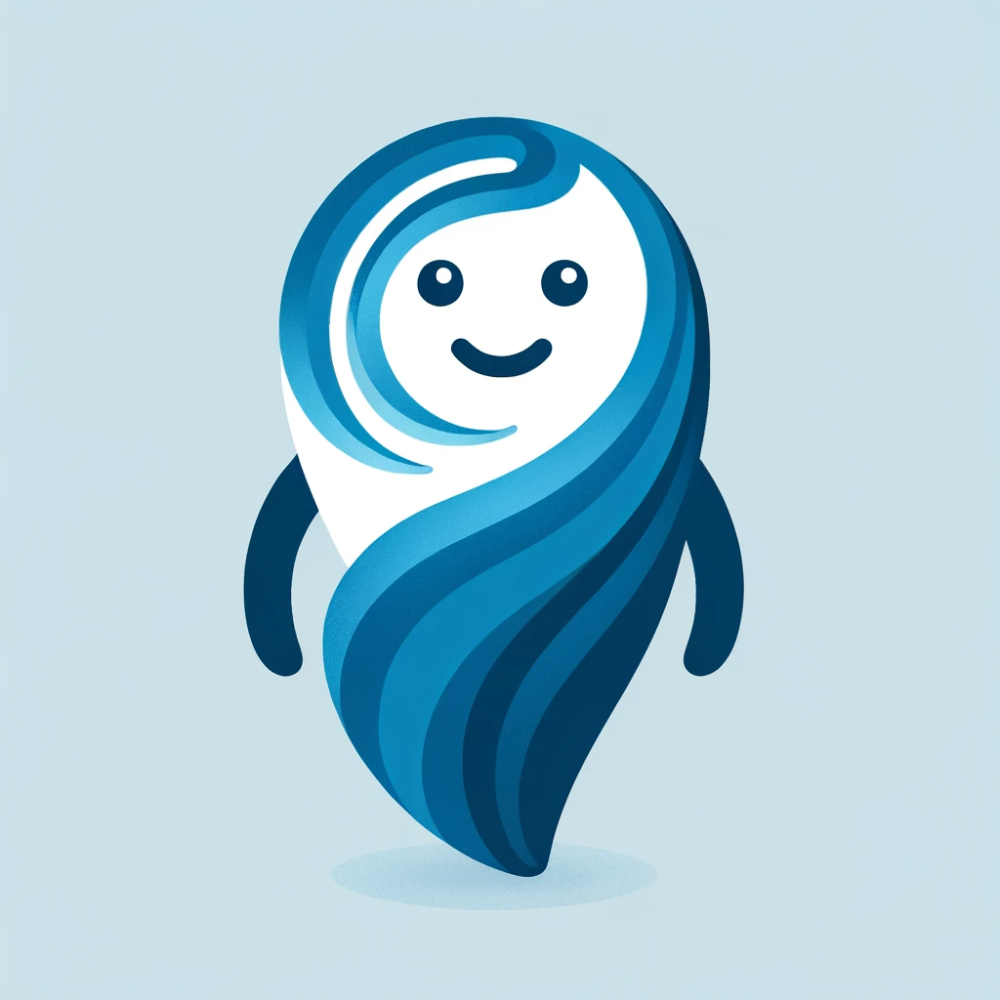

# pysplashlive

PySplashLive is a live demo.

## Meet Swirl

Swirl is your guide on an exploration of the Python Programming Language.
Inspired by [PyLadies](https://pyladies.com), Swirl is a friendly, helpful, and
patient mascot to learning Python.

## ✨ Try it in your browser ✨

➡️ **https://willingconsulting.com/pysplashlive**

## Thanks

Based on the [JupyterLite Demo](https://jupyterlite.github.io/demo). Thanks
to the JupyterLite team and Project Jupyter for their work on this project.